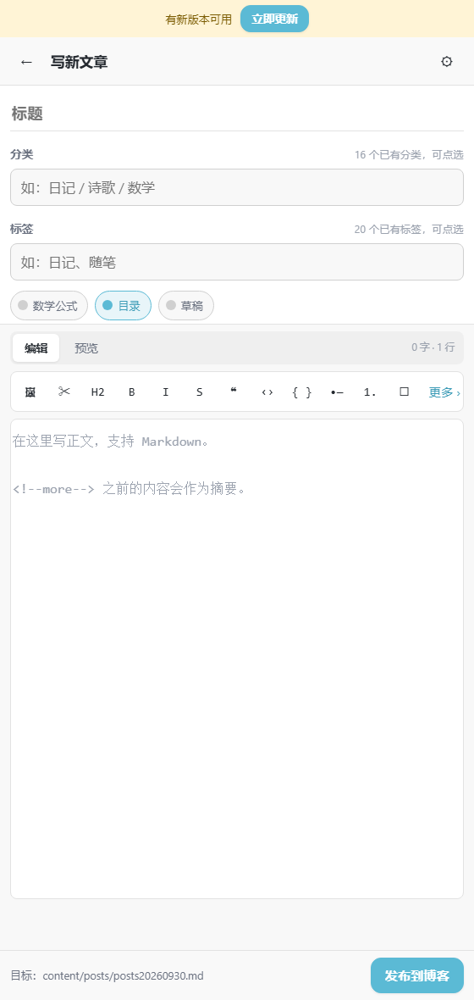
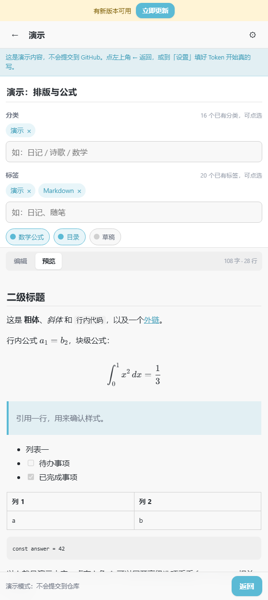
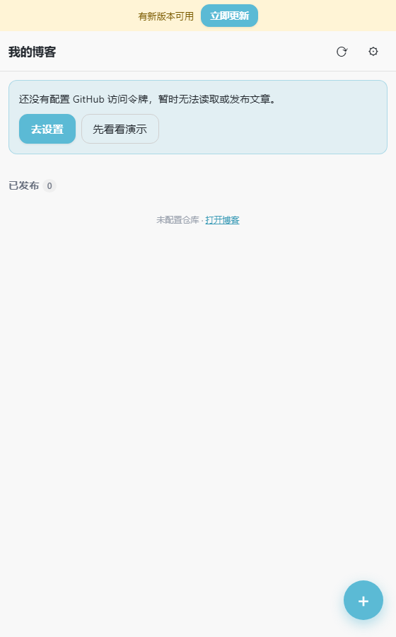
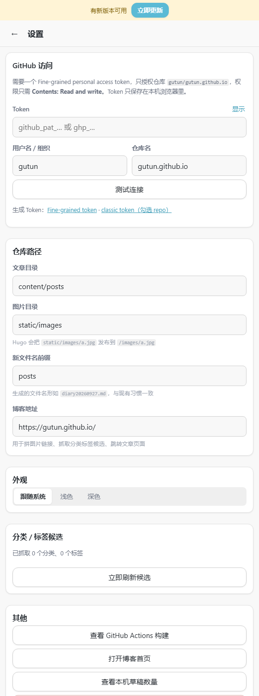

# GUTUN 博客写作 App（`Blog/APP/`）

在手机上写博客的 App：**设置标题 → 选分类和标签 → 用 Markdown 写正文 → 一键发布**。
发布时直接调用 GitHub API 往 `gutun/gutun.github.io` 提交一个 `.md` 文件，
和你现在在 VSCode 里 `hugo new` + `git push` 的效果完全一样，
提交后 GitHub Actions 会自动重新构建 GitHub Pages。

> 这个目录完全不修改原博客仓库：不改 `hugo.toml`、不改主题、不加 workflow。
> 它只是在需要发布时往 `content/posts/` 写一个文件。

---

## 1. 可行性结论

**可行，而且不需要任何服务器。** 原因是你的博客已经具备三个现成条件：

| 现状 | 对 App 的意义 |
| --- | --- |
| 文章是纯 Markdown + YAML front matter（`content/posts/*.md`） | App 只要生成同样格式的文本即可，Hugo 完全无感 |
| 推送 `master` 就触发 `.github/workflows/hugo.yml` 构建部署 | App 提交 = 你 push，不需要额外部署链路 |
| 主题 FixIt 已开启 KaTeX（`math: true`）、目录、搜索等 | App 的预览按同一套语法渲染，写的时候就能看到效果 |

需要接受的三个前提：

1. **需要一个 GitHub Token**（Fine-grained PAT，只授权这一个仓库的 Contents 读写），
   保存在手机浏览器本地，不上传任何第三方。
2. **GitHub Pages 必须开着**（你的 `baseURL` 是 `https://gutun.github.io/`，已经是了）。
3. **App 本身要放在一个 HTTPS 地址上**才能「安装」到手机桌面。
   两种做法见第 3 节：部署到 GitHub Pages（推荐），或先在本机局域网打开试用。

---

## 2. 它长什么样、能做什么

> 截图来自 `#/demo` 演示模式（`docs/screenshots/`），内容为示例，不会提交到仓库。

| 写新文章 | 预览（含 KaTeX 公式） |
| --- | --- |
|  |  |

| 文章列表 | 设置 |
| --- | --- |
|  |  |

| 功能 | 说明 |
| --- | --- |
| 新建文章 | 标题、分类、标签、Markdown 正文；另可展开高级项（时间、文件名、slug、摘要） |
| 编辑已有文章 | 列表里点开仓库中任意一篇，改完提交（用文件 sha 做乐观锁，不会覆盖别人的改动） |
| Markdown 编辑 | CodeMirror 6：语法高亮、工具栏插入（标题/粗体/引用/列表/表格/公式/`<!--more-->`） |
| 实时预览 | `markdown-it` + KaTeX，支持 `$...$`、`$$...$$`、`\(...\)`、`\[...\]`，与站点配置一致 |
| 图片上传 | 手机选图 → 自动压缩到长边 1600px → 提交到 `static/images/` → 自动插入 Markdown 链接 |
| 离线草稿 | 内容存 IndexedDB，断网继续写；联网后再发布 |
| 分类 / 标签联想 | 从线上站点抓取已有分类标签，点一下就填 |
| 演示模式 | `#/demo` 用示例内容展示排版与公式，不需要 Token、不会提交 |
| 深色模式 | 跟随系统 / 手动切换，配色沿用 FixIt 的 `#5bbad5` |
| 可安装（PWA） | 加到手机桌面后全屏运行，有图标、能离线打开 |

生成的 front matter 与 `archetypes/posts.md` 字段顺序、内容一一对应：

```yaml
---
title: 日记 - 在千岛湖
subtitle:
date: 2026-09-27T21:00:34+08:00
slug: 5f91ad5
draft: false
author:
  name: GUTUN
  link:
  email:
  avatar:
description:
keywords:
license:
comment: false
weight: 0
tags:
  - 日记
categories:
  - 日记
hiddenFromHomePage: false
hiddenFromSearch: false
hiddenFromRelated: false
hiddenFromFeed: false
summary:
toc: true
math: true
lightgallery: false
password:
message:
repost:
  enable: true
  url:

# See details front matter: https://fixit.lruihao.cn/documentation/content-management/introduction/#front-matter
---
```

> 小提示：你现在的文章文件名是 `diary20260927.md` 这样的风格。
> 在 App 的「设置 → 仓库路径 → 新文件名前缀」里填 `diary`、`poem`、`book` 等，
> 生成的文件名就会跟着变。文章网址由 `slug` 决定（`hugo.toml` 里 `posts = "/posts/:slug"`），
> 与文件名无关，所以随时可以改。

---

## 3. 怎么在手机上用起来

### 第 1 步：生成 GitHub Token（只做一次）

1. 打开 <https://github.com/settings/personal-access-tokens/new>
2. **Token name**：随便填，例如 `blog-app`
3. **Expiration**：按需选择（例如 1 年）
4. **Repository access** → 选 *Only select repositories* → 勾选 **`gutun.github.io`**
5. **Permissions** → *Repository permissions* → 找到 **Contents** → 选 **Read and write**
   （Metadata 会自动变成 Read-only，这是必须的）
6. 点 **Generate token**，把 `github_pat_...` 复制下来（只显示一次）

> 这个 Token 只能读写你指定的这一个仓库的内容，权限最小。
> 它只保存在手机浏览器本地（IndexedDB），App 没有任何后端。

### 第 2 步-A：部署到 GitHub Pages（推荐，这样才能装成 App）

App 需要一个 HTTPS 地址。最省事的办法是把它放到一个**新仓库**（不碰原博客仓库）：

```bash
# 在 Blog/APP 目录里
git init
git add .
git commit -m "blog writing app"
git remote add origin https://github.com/gutun/blog-app.git   # 先在 GitHub 上建好空仓库
git push -u origin main
```

然后在 GitHub 上该仓库 **Settings → Pages → Source 选 "GitHub Actions"**。
仓库里已经带了 `.github/workflows/deploy.yml`，推上去就会自动构建并发布到：

```
https://gutun.github.io/blog-app/
```

构建产物用的是相对路径 + hash 路由，所以放在 `/blog-app/` 这种子路径下也能正常工作。

### 第 2 步-B：先在本机试用（不用部署）

```bash
cd Blog/APP
pnpm install
pnpm build
pnpm serve          # 会打印手机可访问的局域网地址
```

手机连同一个 WiFi，浏览器打开打印出来的地址即可。

> ⚠️ 局域网是 `http://`，浏览器不把它当「安全上下文」，
> 所以这种方式**只能当网页用，装不到桌面**。要装成 App 请走 2-A。

### 第 3 步：装到手机桌面

**Android（Chrome / Edge）**：打开 App 地址 → 右上角 ⋮ → **安装应用 / 添加到主屏幕**。

**iPhone（Safari）**：用 Safari 打开 → 分享按钮 → **添加到主屏幕**。
（iOS 只认 Safari，用微信/Chrome 打开是装不上的。）

### 第 4 步：首次配置

打开 App → 右下角 ⚙ 或「去设置」：

1. 粘贴 Token
2. 确认用户名 `gutun`、仓库名 `gutun.github.io`
3. 点 **测试连接**，看到「✓ 已登录 …」就成功了
4. 回到列表就能看到你现有的 160 多篇文章

> 还没填 Token 也想先看看效果？在列表页点 **「先看看演示」**
> （或直接访问 `#/demo`），会用示例内容渲染一篇带公式、表格、任务列表的文章，
> 演示模式不会提交任何东西。

---

## 4. 日常使用流程

```
写新文章（＋）→ 填标题 → 点分类/标签候选 → 写正文（可切「预览」看公式效果）
→ 需要图就点工具栏 🖼 选照片 → 「发布到博客」 → 等 1–3 分钟博客更新
```

- **改错字**：列表里搜到那篇 → 点开 → 改 → 「更新并发布」
- **没写完**：直接退出，草稿自动存在本机，列表顶部「本机草稿」里能继续
- **公式**：打开「数学公式」开关后，`$a_1$`、`$$\int_0^1 x^2 dx$$` 都能预览
- **摘要**：工具栏 ✂ 插入 `<!--more-->`，它之前的内容会作为摘要
- **查看构建**：设置页有「查看 GitHub Actions 构建」直达链接

---

## 5. 安全说明

- Token 存在手机浏览器的 IndexedDB 里，**只在这台设备上**。
  换手机 / 清了浏览器数据要重新填一次。
- App 是纯静态页面，没有后端，不会把你的 Token 或文章发到 GitHub 以外的地方。
- 提交记录会显示为 `add post: 标题` / `update post: 标题`，在仓库的 commit 历史里一眼可辨。
- 如果 Token 泄露：到 GitHub 上 Revoke 掉即可，仓库内容不受影响。

---

## 6. 开发者信息

```
APP/
├── index.html                 # 入口（含 iOS 安装相关的 meta）
├── vite.config.ts             # base: './' + PWA 清单、Service Worker
├── src/
│   ├── App.tsx                # hash 路由（#/、#/new、#/demo、#/edit/<path>、#/settings）
│   ├── types.ts               # front matter 数据模型、日期/Base64 工具
│   ├── lib/
│   │   ├── github.ts          # GitHub REST：列目录、读文件、写文件、传图片
│   │   ├── frontmatter.ts     # front matter 解析 / 生成（与 archetypes 对齐）
│   │   ├── markdown.ts        # Markdown→HTML + KaTeX 公式 + 任务列表
│   │   ├── drafts.ts          # IndexedDB 离线草稿
│   │   ├── image.ts           # 图片压缩（长边 1600、JPEG 0.82）
│   │   ├── taxonomy.ts        # 抓取线上分类/标签做联想
│   │   └── store.ts(x)        # 全局状态（设置、主题、提示条）
│   ├── components/            # 编辑器、工具栏、分类标签输入、提示条
│   └── screens/               # 列表页、编辑页、设置页
├── tools/
│   ├── make_icons.py          # 生成 PWA 图标（Pillow）
│   ├── serve.mjs              # 零依赖局域网静态服务器
│   └── *.test.mjs             # Node 内置 test runner 的测试
├── docs/screenshots/          # README 用的界面截图
└── .github/workflows/deploy.yml
```

### 常用命令

```bash
pnpm install        # 安装依赖（本机需 nodeLinker: hoisted，见 pnpm-workspace.yaml 注释）
pnpm dev            # 本地开发（http://localhost:5173）
pnpm build          # 类型检查 + 生产构建，产物在 dist/
pnpm test           # front matter 往返测试 + Markdown/公式渲染测试
pnpm serve          # 局域网静态服务（手机浏览器访问）
pnpm icons          # 重新生成图标（需要 Python + Pillow）
```

### 技术选型

React 19 + TypeScript + Vite 7 + `vite-plugin-pwa`。
Markdown 用 `markdown-it`，公式用 KaTeX，编辑器用 CodeMirror 6，
没有任何后端服务、没有第三方统计、没有云函数。

### 测试覆盖了什么

`pnpm test` 里有 24 个用例，其中比较关键的几条：

- 把 `archetypes/posts.md` 和仓库里**全部 160 多篇文章**解析后再序列化，
  结果必须幂等、字段顺序必须与 archetype 一致（防止用 App 改一次就悄悄丢掉字段）
- 标题里带 `:`、`"`、`#`、`&` 时 YAML 不能被写坏
- CRLF / BOM / 缺 front matter / YAML 日期对象 等边界
- 公式里的 `_`、`*` 不被 Markdown 强调语法吃掉；`$a$ 与 $b$` 这种误配不会被当成公式
- 页面上不存在的字段（例如 `collections`）原样保留

---

## 7. 已知限制

- **iOS 必须用 Safari 安装**，而且 iOS 对 PWA 的后台限制较严，编辑长文时不要切太久后台。
- 图片直接提交进仓库（`static/images/`），会让仓库体积增长；App 已压缩到长边 1600px，
  但如果大量发图，建议改用图床再手工贴链接。
- 列表页首次加载会逐篇读取 front matter（默认 6 并发）；公开仓库走
  `raw.githubusercontent.com`，不吃 GitHub API 配额。列表有 2 分钟缓存。
- 没有「删除文章」功能：删文章请仍在 VSCode / GitHub 上做，避免手机上误删。
- 手机上不显示 `MathJax` 相关扩展；KaTeX 字体走 jsDelivr CDN，首次预览公式需要联网
  （之后会被 Service Worker 缓存）。
